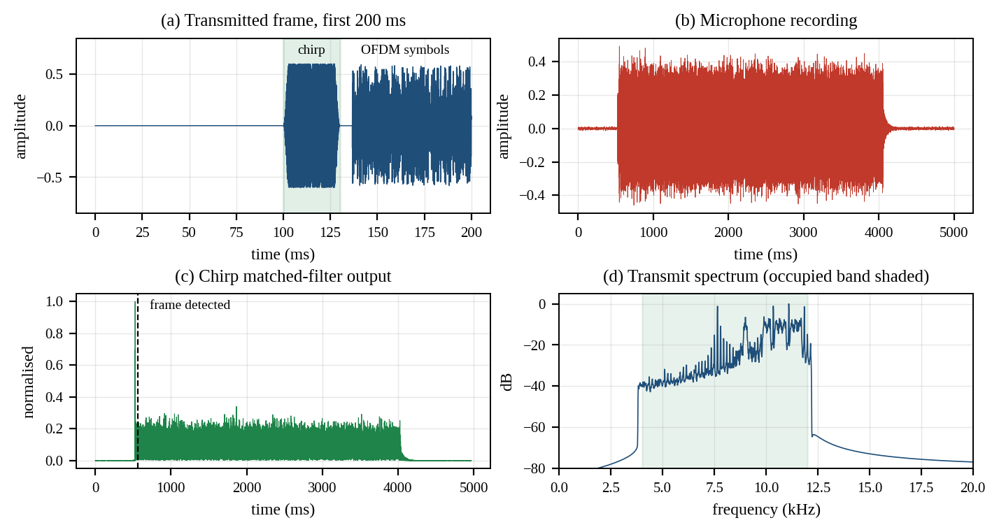
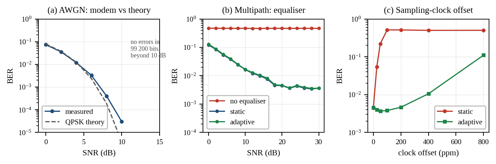
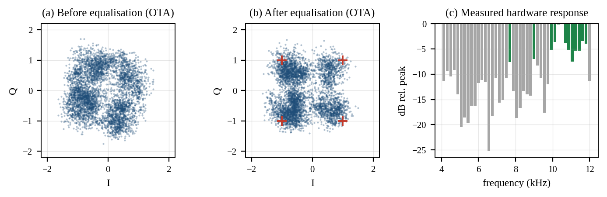
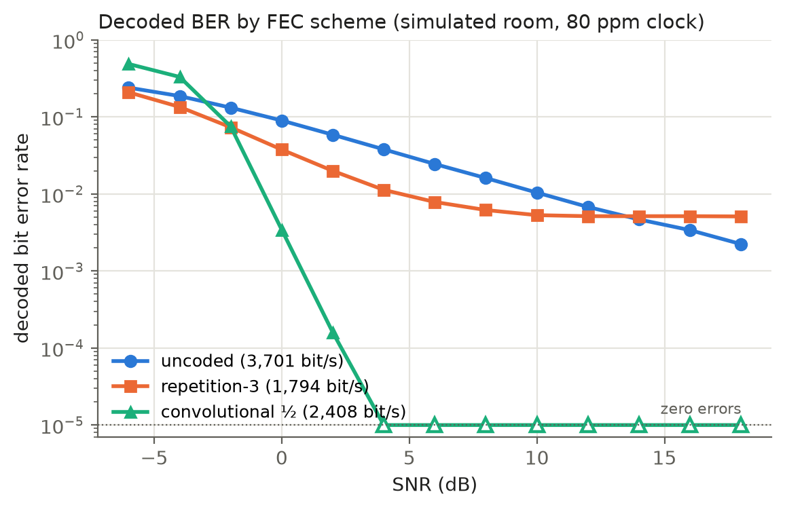
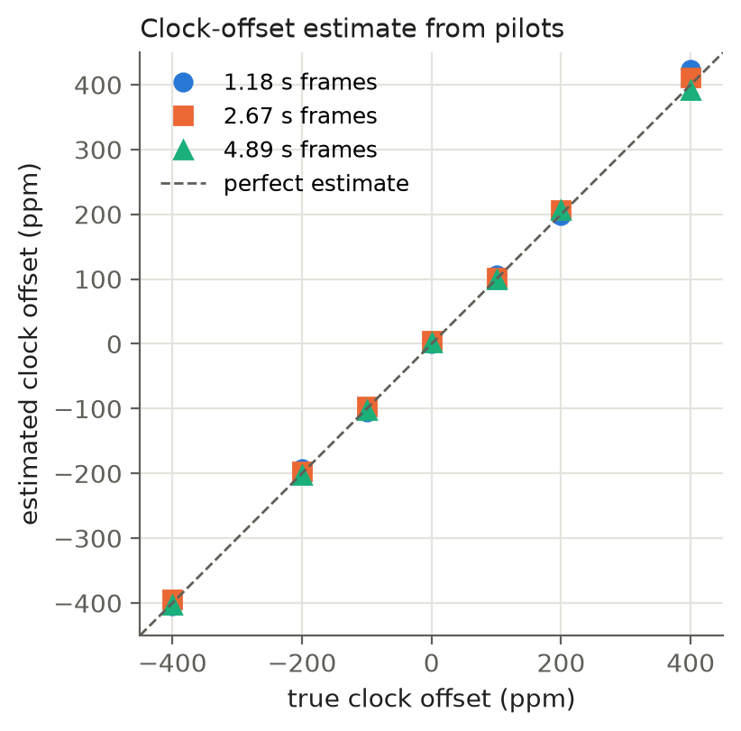
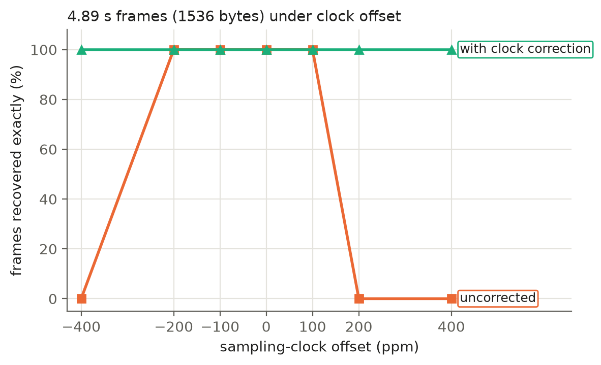

# Adaptive Self-Calibrating OFDM Acoustic Communication — Final Report

**Course:** Signal Processing (custom mini project)
**Team:** Akshay Rukade · J Krithika · Ritesh Gajanan Sonar
**Date:** September 2026 · final review
**Live results dashboard:** https://rukadeakshay01.github.io/acoustic-ofdm/
**Code:** https://github.com/RukadeAkshay01/acoustic-ofdm

> **Draft status.** Every number in this report is generated from the
> repository's results files. The one section still waiting on data is §9, the
> two-device measurement: its tables are marked **[to fill]**. Fill them from
> `python3 experiments/run_two_device.py report`, then update the summary in §1
> and the conclusions in §12.

---

## 1. Summary

We built an OFDM modem that moves files between the speaker and microphone of
ordinary consumer devices in the 4–12 kHz audio band. It is written from scratch
in Python on numpy and scipy, with no audio or communications libraries.

| | Result |
|---|---|
| Modem validation | Measured AWGN BER tracks coherent-QPSK theory; zero errors in 99 200 bits from 12 dB SNR |
| Equalisation | Without it the BER never leaves 0.47 at any SNR; with it the link works |
| Adaptive tracking | At 100 ppm clock offset: static calibration 0.51 (no information), adaptive 3.8 × 10⁻³ — a 135× improvement |
| Real hardware | Stage-1 self-calibration took the over-the-air BER from 0.31 to 8.3 × 10⁻³; text recovered through a real speaker and microphone |
| Error correction | Rate-½ convolutional code: 2 408 bit/s of file data vs 1 794 for repetition-3; every file intact from 4 dB SNR, where repetition-3 needs 18 dB |
| Clock drift | The receiver estimates the offset between devices to within a few ppm and corrects it; 4.9 s frames survive ±400 ppm, where they failed from 200 ppm |
| Two separate devices | **[to fill]** |

### Status against the approved phase plan

| Phase | Requirement | Status |
|---|---|---|
| **1** | Bits → OFDM (IFFT + CP) → speaker → mic → sync → FFT → demod → bits | **Complete**, in simulation and over the air |
| **1** | BER with and without noise | **Complete** |
| **2** | Pilots + one-time channel estimation | **Complete** |
| **2** | Equalisation | **Complete** (MMSE) |
| **2** | BER improvement, equalised vs not | **Complete** |
| **2** | Test across two separate devices | **[to fill]** — tooling and protocol complete (§9) |
| **3** | Adaptive channel tracking from pilots | **Complete** in simulation |
| **3** | Adaptive vs static comparison | **Complete** (§5) |
| **3** | Echo-based distance estimation | **Dropped** after the mid-term review, as the reviewer suggested |
| **3** | Multi-device testing | **[to fill]** |
| — | Web dashboard showing the full pipeline | **Complete** |
| *added* | Proper forward error correction | **Complete** in simulation (§7) |
| *added* | Long-frame clock drift | **Complete** in simulation (§8) |

---

## 2. System design

The whole system is parameterised from one file, `ofdm/config.py`.

| Parameter | Value | Why |
|---|---|---|
| Sample rate | 48 kHz | universally supported by consumer audio hardware |
| FFT size *N* | 256 | 6.7 ms symbol, short enough that the channel is static across it |
| Cyclic prefix | 64 samples (1.33 ms) | covers 0.46 m of excess path length |
| Occupied band | 4–12 kHz | below 4 kHz laptop speakers roll off; above 12 kHz the microphone does |
| Subcarriers | 43 total → 31 data + 12 pilot | pilot every 4th subcarrier, both band edges pinned |
| Modulation | QPSK, Gray coded | 2 bit/subcarrier |
| Raw payload rate | 9 300 bit/s | 62 bits per 6.67 ms symbol |
| Preamble | 30 ms linear chirp, 3–13 kHz | frame sync *and* channel sounding from one signal |
| PAPR reduction | clip to 6 dB above RMS, 3 iterations of clip-and-filter | +3.3 dB average transmit power at no high-SNR cost |
| FEC | repetition-N, or rate-½ K = 7 convolutional with soft Viterbi | §7 |

**Real-valued OFDM without a mixer.** QPSK symbols are placed directly on FFT bins
22–64 with Hermitian symmetry, `X[N−k] = conj(X[k])`. The IFFT output is therefore
real and already sits in the 4–12 kHz band, so it can be written straight to a WAV
file. There is no up/down-conversion stage, and so no carrier-phase bugs.

**Receive chain.** Band-pass filter (zero-phase) → chirp matched filter → FFT
window placed 8 samples inside the cyclic prefix → least-squares estimate from a
known reference symbol → per-symbol pilot tracking → MMSE equalisation → soft
demapping → FEC decode → CRC check per 64-byte packet.

**Self-describing frames.** For two-device use, the receiver knows nothing in
advance. A 32-byte header (magic, length, code type, filename, CRC-32) is sent
first with a fixed repetition-5 code, so it can be decoded blind. It tells the
receiver how many payload symbols follow and which code protects them.

---

## 3. Phase 1 — the modem works, and we can prove it

With multipath switched off, measured BER sits on the coherent-QPSK theory curve,
`Q(√(2·Eb/N0))`. This single test validates the IFFT, cyclic prefix, synchroniser
and demapper together.

| SNR | Measured BER | QPSK theory |
|---|---|---|
| 0 dB | 7.32 × 10⁻² | 7.86 × 10⁻² |
| 2 dB | 3.56 × 10⁻² | 3.75 × 10⁻² |
| 4 dB | 1.20 × 10⁻² | 1.25 × 10⁻² |
| 6 dB | 3.30 × 10⁻³ | 2.39 × 10⁻³ |
| 8 dB | 4.03 × 10⁻⁴ | 1.91 × 10⁻⁴ |
| 10 dB | 3.02 × 10⁻⁵ | 3.87 × 10⁻⁶ |
| ≥ 12 dB | 0 errors in 99 200 bits | — |

Each point is 16 transmissions of 6 200 bits. The small excess above theory at high
SNR is the in-band distortion from peak-to-average reduction, a deliberate trade.
Synchronisation locks to the correct sample down to 0 dB SNR.



---

## 4. Phase 2 — equalisation is not an optimisation, it is the link

Over the simulated multipath channel:

| SNR | No equalisation | Static (one-shot) | Adaptive |
|---|---|---|---|
| 0 dB | 4.73 × 10⁻¹ | 1.21 × 10⁻¹ | 1.29 × 10⁻¹ |
| 6 dB | 4.69 × 10⁻¹ | 3.80 × 10⁻² | 3.94 × 10⁻² |
| 12 dB | 4.67 × 10⁻¹ | 1.21 × 10⁻² | 1.28 × 10⁻² |
| 18 dB | 4.68 × 10⁻¹ | 4.58 × 10⁻³ | 4.83 × 10⁻³ |
| 30 dB | 4.68 × 10⁻¹ | 3.63 × 10⁻³ | 3.62 × 10⁻³ |

Without equalisation BER never leaves 0.47: the frequency selectivity of the
room, not noise, destroys the constellation. Channel-estimation NMSE at 20 dB SNR
is −14.7 dB.

**The ~3.5 × 10⁻³ floor** comes from deep spectral nulls. An uncoded subcarrier in
a 40 dB null is a coin flip regardless of SNR. That is why we use MMSE rather than
zero-forcing (`1/H` amplifies the noise by the same 40 dB). It is also why error
correction (§7) matters so much.



---

## 5. Phase 3 — adaptive tracking

On a fixed channel adaptive and static are indistinguishable (last two columns
above), so tracking costs nothing when it is not needed. The case that separates
them is two devices that do not share a crystal:

| Clock offset | Static calibration | Adaptive tracking |
|---|---|---|
| 0 ppm | 4.47 × 10⁻³ | 4.54 × 10⁻³ |
| 25 ppm | 5.40 × 10⁻² | 4.02 × 10⁻³ |
| 50 ppm | 2.20 × 10⁻¹ | 3.68 × 10⁻³ |
| **100 ppm** | **5.14 × 10⁻¹** | **3.79 × 10⁻³** |
| 200 ppm | 5.14 × 10⁻¹ | 4.63 × 10⁻³ |
| 400 ppm | 5.00 × 10⁻¹ | 1.05 × 10⁻² |
| 800 ppm | 5.02 × 10⁻¹ | 1.10 × 10⁻¹ |

At 100 ppm, an ordinary difference between two consumer devices, one-shot
calibration gives 0.51 and the link carries no information. Tracking holds it at
3.8 × 10⁻³, a **135× improvement**.

The tracker fits a two-parameter correction at the pilots, bulk gain plus phase
slope across frequency, weighted by |H|². The phase slope is exactly the
signature of a sampling-clock offset. A step size of μ = 0.15 fixes the drifting
case and costs nothing measurable on a fixed channel:

| μ | Fixed channel | 200 ppm drift |
|---|---|---|
| 0 (tracking off) | 1.01 × 10⁻² | 2.42 × 10⁻¹ |
| 0.05 | 1.02 × 10⁻² | 2.54 × 10⁻² |
| **0.15** | **1.03 × 10⁻²** | **9.04 × 10⁻³** |
| 0.50 | 1.03 × 10⁻² | 8.39 × 10⁻³ |

---

## 6. Over the air, on real hardware

A real transmission through a laptop speaker, captured on the same laptop's
microphone via ALSA at 48 kHz.

Sweeping the chirp through the hardware showed the speaker + microphone + room
response varies by **up to 43 dB across the band**, with nulls 35–43 dB deep
between roughly 6.5 and 9 kHz. About a third of the subcarriers were in dead
spectrum. **Stage-1 self-calibration** measures this response before
transmitting and uses only subcarriers within a set backoff of the strongest.

| Configuration | Uncoded BER | Packets recovered |
|---|---|---|
| Full band, no calibration | 3.1 × 10⁻¹ | 0 / 5 |
| Stage 1, 12 dB backoff | 8.7 × 10⁻² | 0 / 5 |
| Stage 1, 8 dB backoff | **8.3 × 10⁻³** | 1 / 5 |
| + repetition-3 | 1.8 × 10⁻² raw → 1.9 × 10⁻³ coded | 3 / 5 |
| + repetition-5 | 5.2 × 10⁻² raw → 6.4 × 10⁻⁴ coded | 4 / 5 |
| best run (repetition-3, 8 dB backoff) | 1.2 × 10⁻² raw → 3.2 × 10⁻⁴ coded | **4 / 5**, 229 / 293 bytes |



**[to fill, optional]** Repeat the best configuration with the convolutional code
(`python3 experiments/run_acoustic.py --mode adaptive --fec conv`) and add the row.

---

## 7. Forward error correction

The mid-term link relied on repetition-3, which spends two-thirds of the airtime
on redundancy and, as the table below shows, still leaves a BER floor.

**Code.** Rate ½, constraint length K = 7, generators (171, 133) octal — the
NASA / IEEE 802.11 code, free distance 10. It is terminated with 6 zero tail bits
and decoded by a vectorised **soft-decision Viterbi** decoder (`ofdm/conv.py`).

**Soft input.** The decoder takes the equalised QPSK values, not hard bits. After
MMSE equalisation a symbol on a weak subcarrier is small, so it contributes little
to the path metric. The equaliser's own reliability estimate becomes the
decoder's confidence.

**Interleaving.** The acoustic channel's errors cluster on the few subcarriers
sitting in spectral nulls, and a Viterbi decoder fails on bursts. A fixed
pseudo-random permutation spreads consecutive coded bits across subcarriers and
symbols, turning null-subcarrier bursts into scattered errors the decoder corrects.

**Result.** The same 293-byte file, through the same simulated rooms (multipath,
transducer roll-off, 80 ppm clock offset), 8 paired trials per point:

| Scheme | Air time | File data rate | BER @ 0 dB | BER @ 2 dB | BER @ 6 dB | BER @ 18 dB | Files intact @ 2 dB | first SNR with all 8 intact |
|---|---|---|---|---|---|---|---|---|
| Uncoded | 0.63 s | 3 701 bit/s | 9.0 × 10⁻² | 5.9 × 10⁻² | 2.4 × 10⁻² | 2.2 × 10⁻³ | 0 % | never (50 % at 18 dB) |
| Repetition-3 | 1.31 s | 1 794 bit/s | 3.8 × 10⁻² | 2.0 × 10⁻² | 7.9 × 10⁻³ | 5.1 × 10⁻³ | 0 % | 18 dB |
| **Convolutional ½** | **0.97 s** | **2 408 bit/s** | **3.4 × 10⁻³** | **1.6 × 10⁻⁴** | **0** | **0** | **88 %** | **4 dB** |

The convolutional code is **34 % faster than repetition-3 and needs about 14 dB
less SNR** to deliver every file intact. Repetition-3's decoded BER stops falling
at 5 × 10⁻³ because block-tiled copies of a bit can land on the same faded
subcarrier, so all three copies are wrong together. The live frame format already
avoided this with a per-copy symbol interleaver; the convolutional code avoids it
by construction.



In the blind two-device chain (simulated, clock offsets −150 to +150 ppm), frames
carrying the convolutional code are 20 % shorter than repetition-3 frames and were
all recovered exactly at every SNR tested down to 0 dB. At 6, 3 and 0 dB,
repetition-3 frames were only partly recovered.

---

## 8. Long frames and clock drift

Every mid-term test used frames shorter than 2 s. With a clock offset ε the FFT
window slides by ε·L samples per symbol (L = 320). The tracker follows the
resulting phase slope, but once the window has slid out of the cyclic prefix the
symbols overlap and no equaliser can recover them.

**The limit is asymmetric.** The window starts 8 samples inside the 64-sample
prefix. Sliding one way it has 56 samples of prefix to use; sliding the other way
it reaches the next symbol after 8. In simulation, uncorrected frames failed at
about +20 samples of drift but survived about −44.

**Clock-offset estimation** (`ofdm/sync.py: estimate_clock_ppm`). For each pair of
neighbouring pilots, `Z_n = P_n[i+1]·conj(P_n[i])` cancels the common phase. Its
angle grows linearly with the symbol index `n` at a rate of `2π·Δk·ε·L/N`.
Unwrapping and fitting a straight line over the whole frame gives the drift rate,
with noise falling as N^−1.5. Pairs are weighted by mean |Z|, so pilots in nulls
barely count. A first version differenced adjacent symbols instead. It was off
by tens of ppm and read a true +80 ppm as −34 ppm, which was useless.

| Frame length | Mean absolute error | Worst error |
|---|---|---|
| 0.62 s | 21 ppm | 31 ppm |
| 1.18 s | 7 ppm | 23 ppm |
| 2.67 s | 5 ppm | 11 ppm |
| 4.89 s | 4 ppm | 9 ppm |



**Correction** (`ofdm/live.py`). After the first decode pass, the receiver
estimates the offset from the first second of payload and resamples the recording
onto the transmitter's clock. It decodes again whenever the uncorrected drift over
the frame would exceed 3 samples, and keeps whichever pass recovered more packets.

Frames recovered exactly (3 trials per cell, 18 dB SNR, repetition-3 frames):

| Frame | −400 ppm | −200 | −100 | 0 | +100 | +200 | +400 ppm |
|---|---|---|---|---|---|---|---|
| 2.67 s, uncorrected | 33 % | 100 % | 100 % | 100 % | 100 % | 67 % | **0 %** |
| 2.67 s, corrected | 100 % | 100 % | 100 % | 100 % | 100 % | 100 % | **100 %** |
| 4.89 s, uncorrected | **0 %** | 100 % | 100 % | 100 % | 100 % | **0 %** | **0 %** |
| 4.89 s, corrected | **100 %** | 100 % | 100 % | 100 % | 100 % | **100 %** | **100 %** |

Correction turned 6 of the 28 settings in the sweep from failing to 100 %. It
never made a setting worse. Two corrected cells, both on 1.18 s frames, are
still imperfect. At −100 ppm the frame fails identically without correction, so
drift is not the cause. At +400 ppm correction raises it from 33 % to 67 %.



---

## 9. Two separate devices

> **[to fill]** This section needs the measurement. Procedure:
> `reports/04_two_device_test_protocol.md`. After the session run
> `python3 experiments/run_two_device.py report` and copy
> `results/two_device_summary.json` into the tables below.

**Setup.** Transmitter: **[device model]**. Receiver: **[device model]**.
Room: **[room]**. TX volume: **[%]**. Frames: 5 per setting, 197-byte test text.

| Setup | Distance | Frames | Decoded | Exact | Clock offset (ppm) | EVM (dB) | Raw BER |
|---|---|---|---|---|---|---|---|
| A → B, repetition-3 | 0.5 m | | | | | | |
| A → B, repetition-3 | 1 m | | | | | | |
| A → B, repetition-3 | 2 m | | | | | | |
| A → B, repetition-3 | 3 m | | | | | | |
| A → B, convolutional | 1 m | | | | | | |
| A → B, convolutional | 3 m | | | | | | |
| B → A, repetition-3 | 1 m | | | | | | |

**What to report.**
- **The measured clock offset.** Is it stable from frame to frame (small ±)?
  Does it flip sign when the roles swap? A sign flip is strong evidence it is the
  hardware, not noise.
- **Place it on the §5 table.** At the measured offset, what would static
  calibration have given? This is the project's headline claim tested on real
  hardware.
- **Compare the codes.** At what distance does each first fail?

---

## 10. Engineering log

None of these were predictable from theory.

**Mid-term (details in the mid-term report §7):**

1. The chirp was 6 dB too quiet to be found, because the frame was normalised by
   its OFDM peak. Fix: scale preamble and payload separately.
2. Pilot interpolation aliased: a bulk group delay rotated H by 46° per
   subcarrier, which is 184° between pilots. Fix: FFT-window backoff < N/(2·pilot
   spacing).
3. Naive adaptive tracking raised BER from 3 × 10⁻⁴ to 0.1. Fix: track a
   parametric multiplicative correction instead of re-interpolating H.
4. Three hardware faults looked like DSP bugs: the ALSA start-up click, the mic gain
   34 dB down, and a muted speaker.
5. A last-packet framing bug. Fix: pad every packet to the same length.
6. An NMSE metric scoring a harmless phase ramp as +22.9 dB error.

**Since the mid-term:**

7. **Repetition-3 has an error floor.** Its decoded BER stops at 5 × 10⁻³ in
   simulation however high the SNR. Block-tiled copies can share a faded
   subcarrier, so majority voting has nothing independent to vote on. Motivated
   the interleaved convolutional code.
8. **The first clock estimator was noise.** Differencing adjacent symbols was
   off by tens of ppm on 1 s frames and read +80 ppm as −34 ppm. A line fit over
   the whole frame cut the error to a few ppm.
9. **Drift failure is asymmetric** (§8): 8 samples of margin one way, 56 the
   other. Frames died at +200 ppm while surviving −200.
10. **Multi-frame recordings dropped frames.** The synchroniser locks onto the
    *strongest* chirp, so decoding a recording of several frames started from
    the loudest one and skipped earlier ones. Fix: find every chirp first, then
    decode each frame in its own window.
11. **Uncoded frames failed even in simulation** with the old default settings
    (0 of 5 packets at 18 dB). One bit error destroys a 72-byte packet. The
    default is now repetition-3 with 8 dB backoff, and the convolutional code is
    recommended.

---

## 11. Limitations and future work

- **Two-device results** — **[to fill / remove once §9 is complete]**.
- **Coding and drift correction on real audio.** Both are verified in simulation;
  §9 is where they meet real hardware.
- **Bit-loading.** The equalised error floor could be lowered further by putting
  fewer bits (BPSK) on weak subcarriers and more (16-QAM) on strong ones instead
  of dropping weak subcarriers entirely. Not implemented.
- **Rate.** 2.4 kbit/s of file data is enough for text and small files. Higher
  order modulation on the strong subcarriers is the obvious next step.
- **Audibility.** The 4–12 kHz band is audible. Near-ultrasonic operation
  (17–20 kHz) would be inaudible but is poorly supported by laptop microphones.

---

## 12. Conclusions

**[to fill once §9 is in. Suggested structure: what the project set out to show;
what the measurements show; whether the two-device result confirms the
simulated clock-offset result.]**

From the results so far:

1. A software-only OFDM modem through ordinary consumer audio hardware works, and
   its measured BER matches theory.
2. Equalisation is not optional: without it the acoustic channel carries nothing.
3. Measuring the hardware response first (Stage-1 self-calibration) mattered
   more on real hardware than any receiver-side improvement.
4. One-shot calibration fails outright at ordinary cross-device clock offsets;
   pilot tracking, clock estimation and resampling keep the link working, even
   for multi-second frames.
5. A standard convolutional code with soft decisions and interleaving beats
   repetition on both throughput and robustness.

---

## 13. Contributions

| Member | Owned |
|---|---|
| **Akshay Rukade** | OFDM modulation/demodulation engine: IFFT, cyclic prefix, QPSK, pilot and preamble design, PAPR reduction (`ofdm/modem.py`, `ofdm/config.py`) |
| **J Krithika** | Channel estimation, equalisation, adaptive tracking, Stage-1 self-calibration (`ofdm/equalizer.py`, `ofdm/calibrate.py`) |
| **Ritesh Gajanan Sonar** | Synchronisation, framing, audio I/O, BER analysis, web dashboard (`ofdm/sync.py`, `ofdm/receiver.py`, `ofdm/channel.py`, `ofdm/framing.py`, `ofdm/audio_io.py`, `experiments/`, `dashboard/`) |
| **Post-mid-term work** | **[to fill: who owned the convolutional code, clock estimation and correction, two-device tooling and measurements, tests]** |

---

## 14. Reproduction

```bash
pip install -r requirements.txt
python3 -m unittest discover -s tests -t .      # 28 tests
python3 experiments/run_ber.py                  # §3–5
python3 experiments/run_papr.py                 # PAPR trade-off
python3 experiments/run_fec.py                  # §7
python3 experiments/run_drift.py                # §8
python3 experiments/run_two_device.py sim       # §9, simulated rehearsal
python3 experiments/make_report_figures.py      # figures 4–6
python3 experiments/export_dashboard.py && python3 build_dashboard.py
```

No figure or number in this report is illustrative; every one is generated from
measured or simulated output in `results/`.
